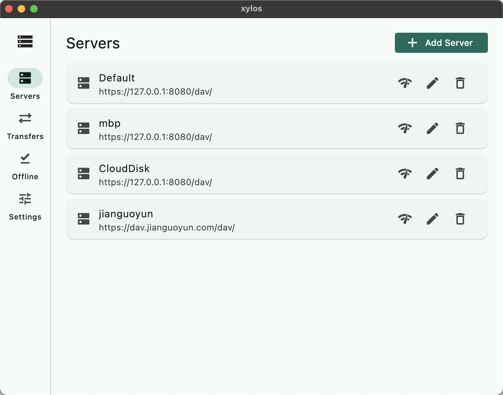
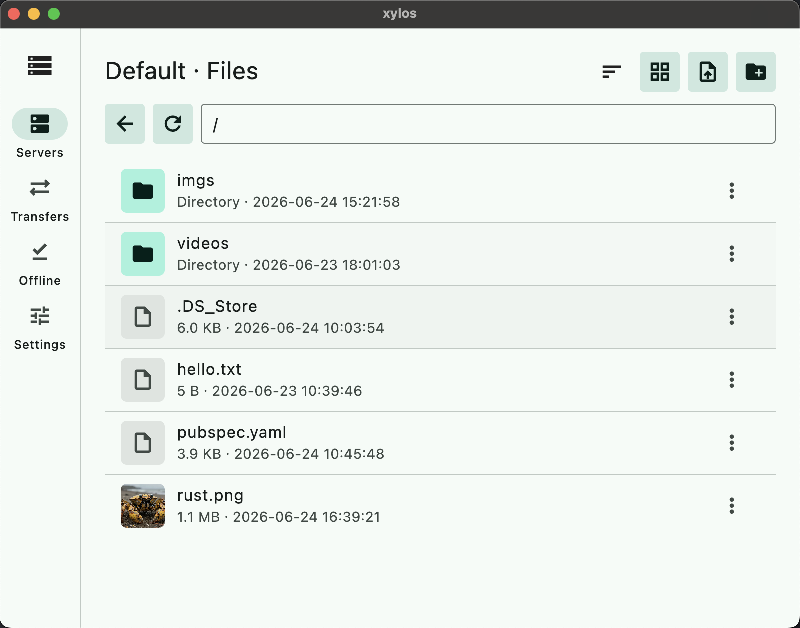
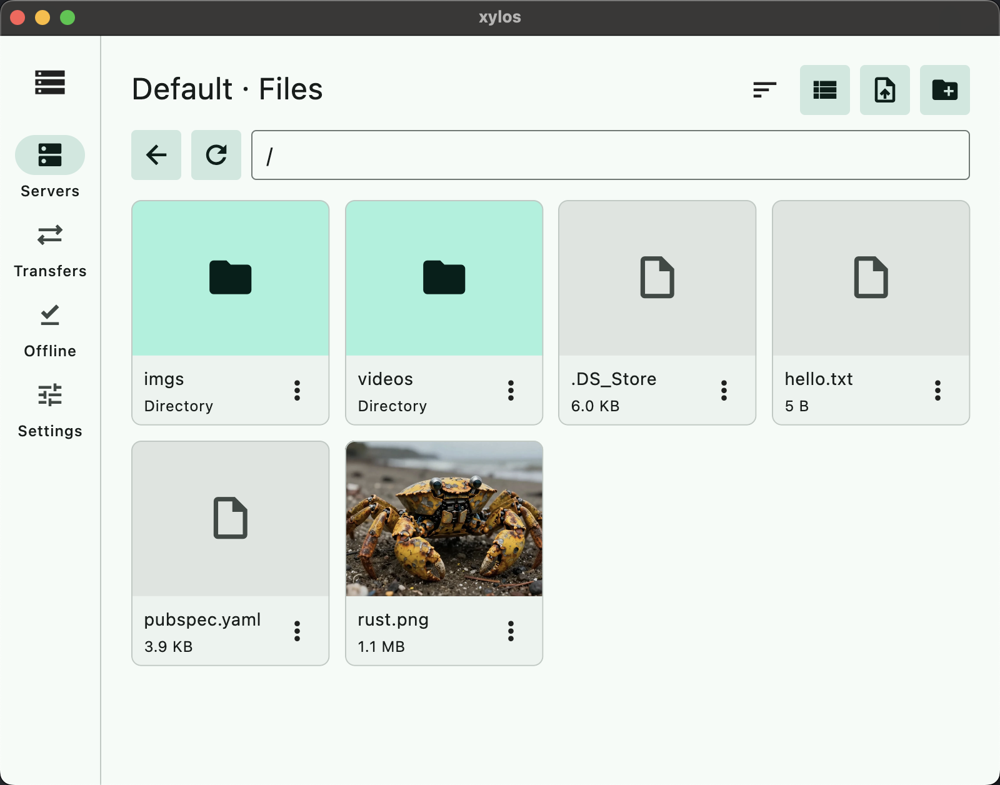

# Xylos WebDAV Client

[中文](./README.zh.md)

Xylos WebDAV Client is a cross-platform WebDAV client built with Flutter, targeting Android, iOS, Windows, macOS, and Linux.

## Preview

### Server Management

This screen is used to manage WebDAV server connections, including adding, reviewing, and selecting saved server configurations.



### File List View

This view is optimized for browsing remote files in a list layout, making it easier to inspect metadata and hierarchy.



### File Grid View

This view presents files in a more visual grid layout, which works well for quick browsing in touch-oriented scenarios.



## Setup

```sh
flutter pub get
flutter doctor
```

Some platforms require their native host toolchains:

- Android: Android SDK is required.
- iOS: macOS, Xcode, and valid signing configuration are required.
- macOS: macOS and Xcode are required.
- Windows: Windows and the Visual Studio C++ toolchain are required.
- Linux: Linux desktop build dependencies are required.

## Run

Generic command:

```sh
flutter run
```

Run on a specific platform:

```sh
flutter run -d android
flutter run -d ios
flutter run -d macos
flutter run -d windows
flutter run -d linux
```

List available devices:

```sh
flutter devices
```

## Build

Android:

```sh
flutter build apk --release
flutter build appbundle --release
```

iOS:

```sh
flutter build ios --release
flutter build ipa --release
```

macOS:

```sh
flutter build macos --release
```

Windows:

```sh
flutter build windows --release
```

Linux:

```sh
flutter build linux --release
```

## Quality Checks

```sh
flutter analyze
flutter test
dart format .
```
