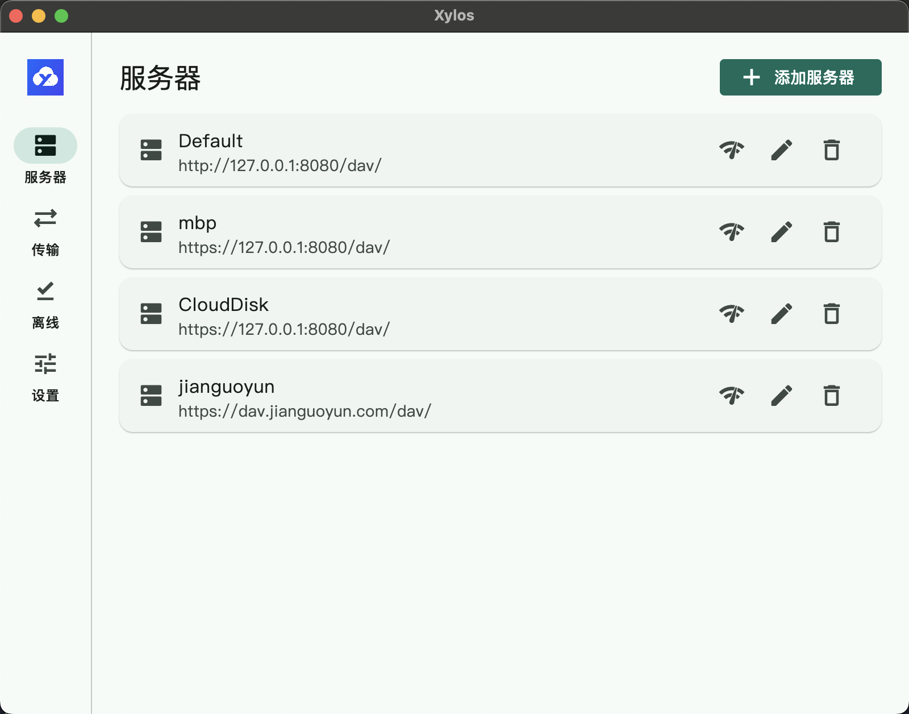
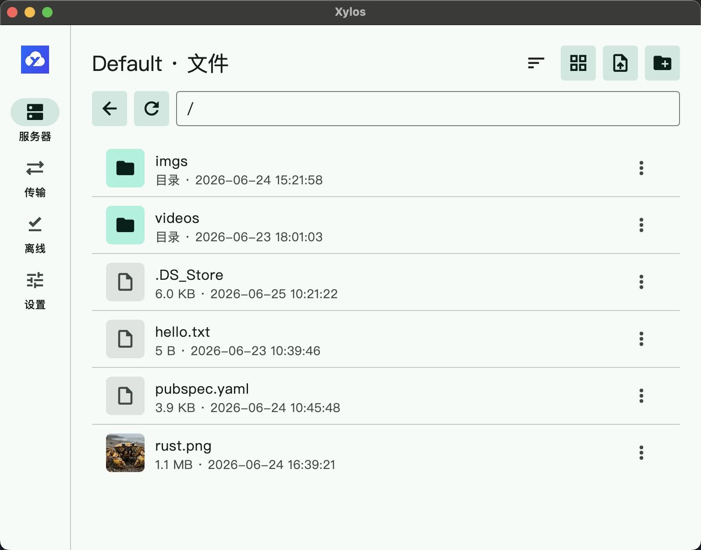
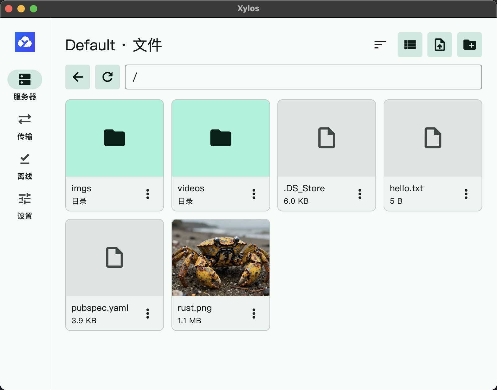

# Xylos WebDAV Client

[English](./README.md)

Xylos WebDAV Client 是一个基于 Flutter 的跨平台 WebDAV 客户端，目标支持 Android、iOS、Windows、macOS 和 Linux。

## 项目预览

### 服务器管理

用于管理 WebDAV 服务器连接入口，便于添加、查看和选择服务端配置。



### 文件列表视图

用于以列表方式浏览远程文件，适合查看更多元数据和层级信息。



### 文件网格视图

用于以更直观的缩略卡片方式浏览文件，适合触控场景下快速切换内容。



## 环境准备

```sh
flutter pub get
flutter doctor
```

部分平台需要在对应宿主系统上构建：

- Android：需要 Android SDK。
- iOS：需要 macOS、Xcode 和有效签名配置。
- macOS：需要 macOS 和 Xcode。
- Windows：需要 Windows 和 Visual Studio C++ 工具链。
- Linux：需要 Linux 桌面构建依赖。

## 运行

通用运行命令：

```sh
flutter run
```

指定平台运行：

```sh
flutter run -d android
flutter run -d ios
flutter run -d macos
flutter run -d windows
flutter run -d linux
```

查看可用设备：

```sh
flutter devices
```

## 打包

Android：

```sh
flutter build apk --release
flutter build appbundle --release
```

iOS：

```sh
flutter build ios --release
flutter build ipa --release
```

macOS：

```sh
flutter build macos --release
```

Windows：

```sh
flutter build windows --release
```

Linux：

```sh
flutter build linux --release
```

## 质量检查

```sh
flutter analyze
flutter test
dart format .
```
